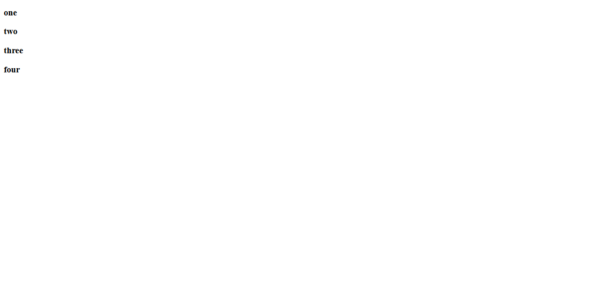

# show-elements-in-html-using-async-await
this is a simple project that contains html,css and Js file. it shows elements (element by element) on screen using async/await

## Table of contents

- [Overview](#overview)
- [Installation](#Installation)
- [Links](#Links)
- [Screenshot](#Screenshot)
- [What I learned](#what-i-learned)
- [Continued development](#continued-development)
- [Author](#author)
- [Acknowledgments](#Acknowledgments)


## overview
this is a simple project that contains html,css and Js file. it show elements (element by element) on screen using async/await
the project has two js file we can switch between them ,both shows elements (element by element) on screen using  "async/await" or "promises chain"


## Installation
To get started with this project, follow these steps:

you can clone the project or download it as Zip file.
 Clone the repository:
   ```bash
   git clone https://github.com/olahasan/show-elements-in-html-using-async-await.git
```

## Links

If you want to open the link in a new tab, you can:

- Press **Ctrl** (or **Cmd** on Mac) while clicking the link.
- Right-click the link and select **Open link in new tab**.

Otherwise, all links will open in the same tab.

- Solution URL: [here](https://github.com/olahasan/show-elements-in-html-using-async-await)

- Live Site URL: [here](https://olahasan.github.io/show-elements-in-html-using-async-await/)


 ## Screenshot
 



## what-i-learned
Through this project:
- I learned how to create project dependent on "async/await" or "promises chain" in js.
- how to collect between html,css and Js file.
- how to push it on github + gh-pages 

## Continued Development
In the future, I plan to:
- do the same project using reactJs 

### Author

GitHub - @olahasan
**[olahasan](https://github.com/olahasan)**

### Acknowledgments
I would like to thank the **[tarmeez academy](https://www.youtube.com/@tarmeez)** for providing this challenge and to the community for their support.
